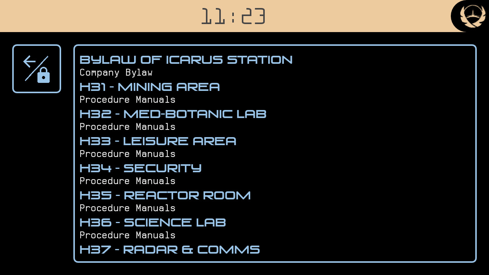

You can find the description for the Icarus Clock Widget [here](clock.md)

# Icarus Launcher

This is a description for my app "Icarus Launcher", which can be found in the [Google Play Store](https://play.google.com/store/apps/details?id=at.thrakbad.icaruslauncher) or as an [APK download](https://goo.gl/LXag8Q). It should work for Android devices with Android API level 4.0.3 or higher.


Icarus Launcher is a custom launcher for Android phones built solely for the LARP Icarus by Terre Spezzate. It won't be useful for anyone outside the game. It replaces the launcher (= home screen) of your Android phone and offers functionality you might find useful during the game. It also alters the look and feel of your device to allow for a maximum of immersion.

It offers the following features:
* clock running on the 14h station time cycle
* personal log where you can type notes, record audio clips, or save pictures
* a customizable set of station regulations for easy lookup during the game
* access to all apps on your phone through a list stripped of the icons. No need to find a sci-fi icon for your calculator
* possibility to hide apps you don't want to use
* all of the above locked with a keyguard, so you can disable the lockscreen of your device entirely
* customizable colour scheme
* can be locked to all orientations of your device, in case you want to carry it in some crazy configuration

I built this thing in a very short time, so it is possible there are bugs and it might not run on your device.

## Instruction
Install the app and start it by pressing the home button. You should set it as the default launcher once your device asks you to.

On the first launch, the app will show you the configuration screen. This will only be shown once, so do not miss it. If you need to see it another time, you need to clear the app data.

**If you are running Android 6 or later:** if you want to use the audio recording features, please go to the app settings from here and click on permissions in the following screen. Enable the record audio permission, and go back to the configuration screen with the back button. The storage permission is required to read regulations and blocked apps from your download folder (see the sections for more information).

Once you are done on the configuration screen, leave it via the back button. You will see the Launcher home screen.

## Clock
The clock automatically runs on the scheduled time for the Icarus International run. It offers a few of customization options. You can access the clock settings by tapping on the top bar in any screen where it is shown.

Clock colours will be used by the rest of the launcher as well, to maintain a coherent UI, so feel free to customise this.

The clock allows you to select your shift. It will then remind you, when it is time for you to sleep.

## Keyguard


The Launcher automatically locks itself once the screen is turned off. You can lock it manually by pressing the lock icon on the home screen or long-pressing the back/lock icon on the other screens. This lock is simply a keyguard, it will not provide any security for your notes. After consulting with Terre Spezzate, this is intentional. It will be difficult enough to steal a device, and doing that might enable cool ingame situations.

## Personal log

The core of the launcher is a personal log for the events you encounter during the game. I didn't just want to create a notebook, so I added a few twists to this part, that might enable a bit of nice play.

Log entries can not be edited once they are saved. This is partly because it saved me the time to build that functionality, but mostly so you can't easily delete incriminating information. You can delete log entries. However, nothing is truly lost in a world of advanced tech, so I decided to at least show that a log entry was originally there. It is play to lose after all, and having a bunch of deleted log entries from a suspicious time, is a great way to get us into trouble. And who knows, maybe there are even some ways to partially restore them? I explain this in game by every device being connected to a huge network, where it might take days to purge an entry from all running nodes and backups.


You can create log entries by typing them (or using the very funny speech-to-text function), by recording audio, or by taking a picture with your device camera. All methods for creating a log entry are available from the launcher or from the journal listing the log entries.


To start an audio recording, simply tap the microphone button. A red indicator will be shown when the recorder is running. Tapping the button again will stop and save the recording. Recording audio even works when the screen is off or the launcher is locked, so you can easily record in secret. **Recording prevents your device from going to sleep, so it can be a drain on the battery.**

## Regulations



On Icarus, there are a lot of regulations and you might not have learned every detail of it. That's why you can look them up in the regulations section. The app comes preloaded with the *Company Bylaw*, the design document (disguised as *Safety Regulations*) and all work *Procedure Manuals*. However, you can also put your own `.pdf` files in there, if you need anything else. To do that:

* create a folder `regulations` within your Android download folder. This is the folder where Android will store downloaded files by default.
* put your `.pdf` file in the folder
* create a `.txt` file with the name of the category you want your document to be in. E.g. documents in the *Procedure Manuals* category are listed in the file `Procedure Manuals.txt`
* enter the name of the `.pdf` file without the `.pdf` extension in a line in the created `txt` file. E.g. the file `BYLAW of Icarus Station.pdf` needs to be listed as *BYLAW of Icarus Station*

## Apps


Of course you might want to use your device in any way I can't really forsee during the game, so the launcher of course also allows you to access your apps as usual. Apps will be shown in a simple list, without Icons. That is because most of them don't look very sci-fi.

Hiding apps. Since it is not very canon to have the Google Play Store available on a device, you can create a list of blocked apps, that will not be shown by the launcher. To do so

* create a file `blocked.txt` in your devices download folder. This is the folder where Android usually stores files you download from the internet.
* enter the names of every app you wish to hide in an individual line.

My file looks like this, for example.

```
Chrome
Play Store
Drive
Camera
Play Newsstand
Photos
Calendar
Contacts
Clock
Phone
Gmail
Play Music
Play Movies & TV
Youtube
Downloads
FM Radio
Play Books
Google Handwriting Input
Maps
Duo
Wallpapers
Google
Keep
Play Games
Support
```

**WARNING: if you exclude the Settings app, you might not be able to remove the launcher easily after the game. So it is best to leave it in there.**

## Privacy

Google requires me to include a privacy policy. So here it goes. This app can record audio and images, and can read from your external storage. All recordings will stay on the device, and will be removed once tha pp is uninstalled. The access to your external storage is required if you want to add your own list of blocked apps or regulations. Since the app has no internet permission, your data can not be secretly transmitted anywhere. Also all of it will be fictional anyways, so what would I do with that? :-)

## Contact

If you want to thank me, I will be playing J. Kowalski (#5) in the international run. I'll be happy to hear from you how you liked the app.

Contact me [on facebook](https://www.facebook.com/Thrakbad) or [via mail](mailto:thorsten.schillo@googlemail.com), or [create an issue on github](https://github.com/Thrakbad/Thrakbad.github.io/issues).
